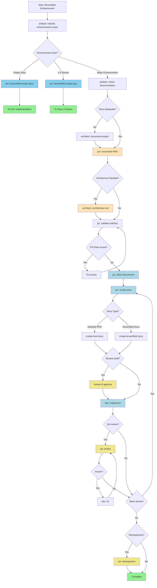

## Sequence

1. **Enhancement Classification**
   - Agent: analyst
   - Action: Classify enhancement scope
   - Notes: |
     Determine enhancement complexity to route to appropriate path:
     - Single story (< 4 hours) → Use brownfield-create-story task
     - Small feature (1-3 stories) → Use brownfield-create-epic task
     - Major enhancement (multiple epics) → Continue with full workflow

2. **Documentation Check**
   - Agent: analyst
   - Action: Check existing documentation
   - Condition: Major enhancement path
   - Notes: |
     Check if adequate project documentation exists:
     - Look for existing architecture docs, API specs, coding standards
     - Assess if documentation is current and comprehensive
     - If adequate: Skip document-project, proceed to PRD
     - If inadequate: Run document-project first

3. **Project Analysis**
   - Agent: architect
   - Action: Analyze existing project using document-project
   - Creates: brownfield-architecture.md (or multiple documents)
   - Condition: Documentation inadequate
   - Notes: Run document-project to capture current system state, technical debt, and constraints.

4. **Create PRD**
   - Agent: pm
   - Creates: prd.md
   - Uses: brownfield-prd-tmpl
   - Requires: Existing documentation or analysis
   - Notes: |
     Creates PRD for major enhancement. If document-project was run, reference its output to avoid re-analysis.
     SAVE OUTPUT: Copy final prd.md to your project's docs/ folder.

5. **Architecture Decision**
   - Agent: pm/architect
   - Action: Determine if architecture document needed
   - Condition: After PRD creation
   - Notes: |
     Review PRD to determine if architectural planning is needed:
     - New architectural patterns → Create architecture doc
     - New libraries/frameworks → Create architecture doc
     - Platform/infrastructure changes → Create architecture doc
     - Following existing patterns → Skip to story creation

6. **Create Architecture Document**
   - Agent: architect
   - Creates: architecture.md
   - Uses: brownfield-architecture-tmpl
   - Requires: prd.md
   - Condition: Architecture changes needed
   - Notes: Creates architecture ONLY for significant architectural changes.

7. **Artifact Validation**
   - Agent: po
   - Validates: All artifacts
   - Uses: po-master-checklist
   - Notes: Validates all documents for integration safety and completeness.

8. **Document Sharding**
   - Agent: po
   - Action: Shard documents
   - Creates: Sharded documentation
   - Requires: All artifacts in project
   - Notes: |
     Shard documents for IDE development:
     - Creates docs/prd/ and docs/architecture/ folders with sharded content

9. **Story Creation**
   - Agent: sm
   - Action: Create story
   - Creates: story.md
   - Requires: Sharded docs or brownfield docs
   - Repeats: For each epic or enhancement
   - Notes: |
     Story creation cycle:
     - For sharded PRD: Use create-next-story
     - For brownfield docs: Use create-brownfield-story task
     - Creates story from available documentation
     - Story starts in "Draft" status

10. **Implementation**
    - Agent: dev
    - Action: Implement story
    - Creates: Implementation files
    - Requires: story.md
    - Notes: Implements approved story and updates file list with all changes.

11. **QA Review**
    - Agent: qa
    - Action: Review implementation
    - Updates: Implementation files
    - Optional: true
    - Notes: |
      QA Agent reviews implementation:
      - Senior dev review with refactoring ability
      - Fixes small issues directly
      - Leaves checklist for remaining items

## Flow Diagram



## Decision Guidance

### When to Use
- Enhancement requires coordinated stories
- Architectural changes are needed
- Significant integration work required
- Risk assessment and mitigation planning necessary
- Multiple team members will work on related changes

## Handoff Prompts

### Classification Complete
```
Enhancement classified as: {{enhancement_type}}
{{if single_story}}: Proceeding with brownfield-create-story task for immediate implementation.
{{if small_feature}}: Creating focused epic with brownfield-create-epic task.
{{if major_enhancement}}: Continuing with comprehensive planning workflow.
```

### Documentation Assessment
```
Documentation assessment complete:
{{if adequate}}: Existing documentation is sufficient. Proceeding directly to PRD creation.
{{if inadequate}}: Running document-project to capture current system state before PRD.
```

### Document Project to PM
```
Project analysis complete. Key findings documented in:
- {{document_list}}
Use these findings to inform PRD creation and avoid re-analyzing the same aspects.
```

### PM to Architect Decision
```
PRD complete and saved as docs/prd.md.
Architectural changes identified: {{yes/no}}
{{if yes}}: Proceeding to create architecture document for: {{specific_changes}}
{{if no}}: No architectural changes needed. Proceeding to validation.
```

### Architect to PO
```
Architecture complete. Save it as docs/architecture.md. Please validate all artifacts for integration safety.
```

### PO to SM
```
All artifacts validated.
Documentation type available: {{sharded_prd / brownfield_docs}}
{{if sharded}}: Use standard create-next-story task.
{{if brownfield}}: Use create-brownfield-story task to handle varied documentation formats.
```

### SM Story Creation
```
Creating story from {{documentation_type}}.
{{if missing_context}}: May need to gather additional context from user during story creation.
```

### Complete
```
All planning artifacts validated and development can begin. Stories will be created based on available documentation format.
```
