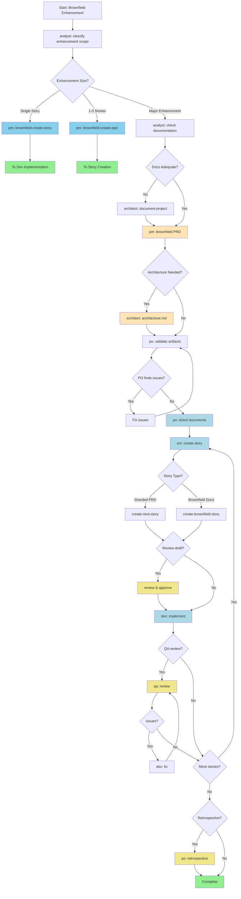

# Brownfield Full-Stack Enhancement

## Workflow Metadata

- **ID:** brownfield-fullstack
- **Type:** brownfield
- **Project Types:** feature-addition, refactoring, modernization, integration-enhancement

## Description

Agent workflow for enhancing existing full-stack applications with new features, modernization, or significant changes. Handles existing system analysis and safe integration.

## Workflow Steps

### enhancement_classification

- **Agent:** analyst
- **Action:** classify enhancement scope
- **Notes:**
  Determine enhancement complexity to route to appropriate path:
  - Single story (< 4 hours) → Use brownfield-create-story task
  - Small feature (1-3 stories) → Use brownfield-create-epic task
  - Major enhancement (multiple epics) → Continue with full workflow
  
  Ask user: "Can you describe the enhancement scope? Is this a small fix, a feature addition, or a major enhancement requiring architectural changes?"

### routing_decision

- **Agent:** N/A
- **Action:** N/A

### documentation_check

- **Agent:** analyst
- **Action:** check existing documentation
- **Notes:**
  Check if adequate project documentation exists:
  - Look for existing architecture docs, API specs, coding standards
  - Assess if documentation is current and comprehensive
  - If adequate: Skip document-project, proceed to PRD
  - If inadequate: Run document-project first

### project_analysis

- **Agent:** architect
- **Action:** analyze existing project and use task document-project
- **Notes:**
  Run document-project to capture current system state, technical debt, and constraints. Pass findings to PRD creation.

### Unnamed Step

- **Agent:** pm
- **Action:** N/A
- **Notes:**
  Creates PRD for major enhancement. If document-project was run, reference its output to avoid re-analysis.
  If skipped, use existing project documentation.
  SAVE OUTPUT: Copy final prd.md to your project's docs/ folder.
- **Requires:** existing_documentation_or_analysis

### architecture_decision

- **Agent:** pm/architect
- **Action:** determine if architecture document needed
- **Notes:**
  Review PRD to determine if architectural planning is needed:
  - New architectural patterns → Create architecture doc
  - New libraries/frameworks → Create architecture doc
  - Platform/infrastructure changes → Create architecture doc
  - Following existing patterns → Skip to story creation

### Unnamed Step

- **Agent:** architect
- **Action:** N/A
- **Notes:**
  Creates architecture ONLY for significant architectural changes. SAVE OUTPUT: Copy final architecture.md to your project's docs/ folder.
- **Requires:** prd.md

### Unnamed Step

- **Agent:** po
- **Action:** N/A
- **Notes:**
  Validates all documents for integration safety and completeness. May require updates to any document.

### Unnamed Step

- **Agent:** various
- **Action:** N/A
- **Notes:**
  If PO finds issues, return to relevant agent to fix and re-export updated documents to docs/ folder.

### Unnamed Step

- **Agent:** po
- **Action:** shard_documents
- **Notes:**
  Shard documents for IDE development:
  - Option A: Use PO agent to shard: @po then ask to shard docs/prd.md
  - Option B: Manual: Drag shard-doc task + docs/prd.md into chat
  - Creates docs/prd/ and docs/architecture/ folders with sharded content
- **Requires:** all_artifacts_in_project

### Unnamed Step

- **Agent:** sm
- **Action:** create_story
- **Notes:**
  Story creation cycle:
  - For sharded PRD: @sm → *create (uses create-next-story)
  - For brownfield docs: @sm → use create-brownfield-story task
  - Creates story from available documentation
  - Story starts in "Draft" status
  - May require additional context gathering for brownfield
- **Requires:** sharded_docs_or_brownfield_docs

### Unnamed Step

- **Agent:** analyst/pm
- **Action:** review_draft_story
- **Notes:**
  OPTIONAL: Review and approve draft story
  - NOTE: story-review task coming soon
  - Review story completeness and alignment
  - Update story status: Draft → Approved
- **Requires:** story.md

### Unnamed Step

- **Agent:** dev
- **Action:** implement_story
- **Notes:**
  Dev Agent (New Chat): @dev
  - Implements approved story
  - Updates File List with all changes
  - Marks story as "Review" when complete
- **Requires:** story.md

### Unnamed Step

- **Agent:** qa
- **Action:** review_implementation
- **Notes:**
  OPTIONAL: QA Agent (New Chat): @qa → review-story
  - Senior dev review with refactoring ability
  - Fixes small issues directly
  - Leaves checklist for remaining items
  - Updates story status (Review → Done or stays Review)
- **Requires:** implementation_files

### Unnamed Step

- **Agent:** dev
- **Action:** address_qa_feedback
- **Notes:**
  If QA left unchecked items:
  - Dev Agent (New Chat): Address remaining items
  - Return to QA for final approval

### Unnamed Step

- **Agent:** N/A
- **Action:** continue_for_all_stories
- **Notes:**
  Repeat story cycle (SM → Dev → QA) for all epic stories
  Continue until all stories in PRD are complete

### Unnamed Step

- **Agent:** po
- **Action:** epic_retrospective
- **Notes:**
  OPTIONAL: After epic completion
  - NOTE: epic-retrospective task coming soon
  - Validate epic was completed correctly
  - Document learnings and improvements

### Unnamed Step

- **Agent:** N/A
- **Action:** project_complete
- **Notes:**
  All stories implemented and reviewed!
  Project development phase complete.
  
  Reference: data#bmad-kb:IDE Development Workflow

## Flow Diagram



```
