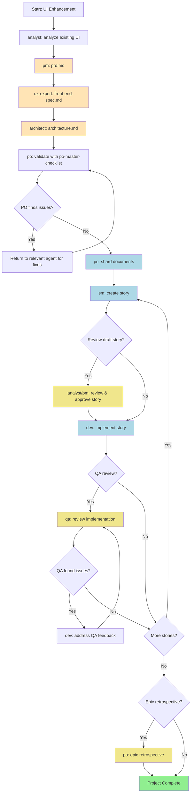

# Brownfield UI/Frontend Enhancement

## Workflow Metadata

- **ID:** brownfield-ui
- **Type:** brownfield
- **Project Types:** ui-modernization, framework-migration, design-refresh, frontend-enhancement

## Description

Agent workflow for enhancing existing frontend applications with new features, modernization, or design improvements. Handles existing UI analysis and safe integration.

## Workflow Steps

### ui_analysis

- **Agent:** architect
- **Action:** analyze existing project and use task document-project
- **Notes:**
  Review existing frontend application, user feedback, analytics data, and identify improvement areas.

### Unnamed Step

- **Agent:** pm
- **Action:** N/A
- **Notes:**
  Creates comprehensive PRD focused on UI enhancement with existing system analysis. SAVE OUTPUT: Copy final prd.md to your project's docs/ folder.
- **Requires:** existing_ui_analysis

### Unnamed Step

- **Agent:** ux-expert
- **Action:** N/A
- **Notes:**
  Creates UI/UX specification that integrates with existing design patterns. SAVE OUTPUT: Copy final front-end-spec.md to your project's docs/ folder.
- **Requires:** prd.md

### Unnamed Step

- **Agent:** architect
- **Action:** N/A
- **Notes:**
  Creates frontend architecture with component integration strategy and migration planning. SAVE OUTPUT: Copy final architecture.md to your project's docs/ folder.
- **Requires:** ['prd.md', 'front-end-spec.md']

### Unnamed Step

- **Agent:** po
- **Action:** N/A
- **Notes:**
  Validates all documents for UI integration safety and design consistency. May require updates to any document.

### Unnamed Step

- **Agent:** various
- **Action:** N/A
- **Notes:**
  If PO finds issues, return to relevant agent to fix and re-export updated documents to docs/ folder.

### Unnamed Step

- **Agent:** po
- **Action:** shard_documents
- **Notes:**
  Shard documents for IDE development:
  - Option A: Use PO agent to shard: @po then ask to shard docs/prd.md
  - Option B: Manual: Drag shard-doc task + docs/prd.md into chat
  - Creates docs/prd/ and docs/architecture/ folders with sharded content
- **Requires:** all_artifacts_in_project

### Unnamed Step

- **Agent:** sm
- **Action:** create_story
- **Notes:**
  Story creation cycle:
  - SM Agent (New Chat): @sm → *create
  - Creates next story from sharded docs
  - Story starts in "Draft" status
- **Requires:** sharded_docs

### Unnamed Step

- **Agent:** analyst/pm
- **Action:** review_draft_story
- **Notes:**
  OPTIONAL: Review and approve draft story
  - NOTE: story-review task coming soon
  - Review story completeness and alignment
  - Update story status: Draft → Approved
- **Requires:** story.md

### Unnamed Step

- **Agent:** dev
- **Action:** implement_story
- **Notes:**
  Dev Agent (New Chat): @dev
  - Implements approved story
  - Updates File List with all changes
  - Marks story as "Review" when complete
- **Requires:** story.md

### Unnamed Step

- **Agent:** qa
- **Action:** review_implementation
- **Notes:**
  OPTIONAL: QA Agent (New Chat): @qa → review-story
  - Senior dev review with refactoring ability
  - Fixes small issues directly
  - Leaves checklist for remaining items
  - Updates story status (Review → Done or stays Review)
- **Requires:** implementation_files

### Unnamed Step

- **Agent:** dev
- **Action:** address_qa_feedback
- **Notes:**
  If QA left unchecked items:
  - Dev Agent (New Chat): Address remaining items
  - Return to QA for final approval

### Unnamed Step

- **Agent:** N/A
- **Action:** continue_for_all_stories
- **Notes:**
  Repeat story cycle (SM → Dev → QA) for all epic stories
  Continue until all stories in PRD are complete

### Unnamed Step

- **Agent:** po
- **Action:** epic_retrospective
- **Notes:**
  OPTIONAL: After epic completion
  - NOTE: epic-retrospective task coming soon
  - Validate epic was completed correctly
  - Document learnings and improvements

### Unnamed Step

- **Agent:** N/A
- **Action:** project_complete
- **Notes:**
  All stories implemented and reviewed!
  Project development phase complete.
  
  Reference: data#bmad-kb:IDE Development Workflow

## Flow Diagram



```
