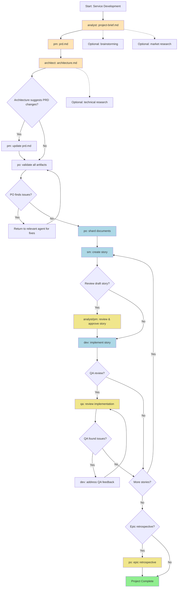

# Greenfield Service/API Development

## Workflow Metadata

- **ID:** greenfield-service
- **Type:** greenfield
- **Project Types:** rest-api, graphql-api, microservice, backend-service, api-prototype, simple-service

## Description

Agent workflow for building backend services from concept to development. Supports both comprehensive planning for complex services and rapid prototyping for simple APIs.

## Workflow Steps

### Unnamed Step

- **Agent:** analyst
- **Action:** N/A
- **Notes:**
  Can do brainstorming first, then optional deep research before creating project brief. SAVE OUTPUT: Copy final project-brief.md to your project's docs/ folder.

### Unnamed Step

- **Agent:** pm
- **Action:** N/A
- **Notes:**
  Creates PRD from project brief using prd-tmpl, focused on API/service requirements. SAVE OUTPUT: Copy final prd.md to your project's docs/ folder.
- **Requires:** project-brief.md

### Unnamed Step

- **Agent:** architect
- **Action:** N/A
- **Notes:**
  Creates backend/service architecture using architecture-tmpl. May suggest changes to PRD stories or new stories. SAVE OUTPUT: Copy final architecture.md to your project's docs/ folder.
- **Requires:** prd.md

### Unnamed Step

- **Agent:** pm
- **Action:** N/A
- **Notes:**
  If architect suggests story changes, update PRD and re-export the complete unredacted prd.md to docs/ folder.
- **Requires:** architecture.md

### Unnamed Step

- **Agent:** po
- **Action:** N/A
- **Notes:**
  Validates all documents for consistency and completeness. May require updates to any document.

### Unnamed Step

- **Agent:** various
- **Action:** N/A
- **Notes:**
  If PO finds issues, return to relevant agent to fix and re-export updated documents to docs/ folder.

### Unnamed Step

- **Agent:** po
- **Action:** shard_documents
- **Notes:**
  Shard documents for IDE development:
  - Option A: Use PO agent to shard: @po then ask to shard docs/prd.md
  - Option B: Manual: Drag shard-doc task + docs/prd.md into chat
  - Creates docs/prd/ and docs/architecture/ folders with sharded content
- **Requires:** all_artifacts_in_project

### Unnamed Step

- **Agent:** sm
- **Action:** create_story
- **Notes:**
  Story creation cycle:
  - SM Agent (New Chat): @sm → *create
  - Creates next story from sharded docs
  - Story starts in "Draft" status
- **Requires:** sharded_docs

### Unnamed Step

- **Agent:** analyst/pm
- **Action:** review_draft_story
- **Notes:**
  OPTIONAL: Review and approve draft story
  - NOTE: story-review task coming soon
  - Review story completeness and alignment
  - Update story status: Draft → Approved
- **Requires:** story.md

### Unnamed Step

- **Agent:** dev
- **Action:** implement_story
- **Notes:**
  Dev Agent (New Chat): @dev
  - Implements approved story
  - Updates File List with all changes
  - Marks story as "Review" when complete
- **Requires:** story.md

### Unnamed Step

- **Agent:** qa
- **Action:** review_implementation
- **Notes:**
  OPTIONAL: QA Agent (New Chat): @qa → review-story
  - Senior dev review with refactoring ability
  - Fixes small issues directly
  - Leaves checklist for remaining items
  - Updates story status (Review → Done or stays Review)
- **Requires:** implementation_files

### Unnamed Step

- **Agent:** dev
- **Action:** address_qa_feedback
- **Notes:**
  If QA left unchecked items:
  - Dev Agent (New Chat): Address remaining items
  - Return to QA for final approval

### Unnamed Step

- **Agent:** N/A
- **Action:** continue_for_all_stories
- **Notes:**
  Repeat story cycle (SM → Dev → QA) for all epic stories
  Continue until all stories in PRD are complete

### Unnamed Step

- **Agent:** po
- **Action:** epic_retrospective
- **Notes:**
  OPTIONAL: After epic completion
  - NOTE: epic-retrospective task coming soon
  - Validate epic was completed correctly
  - Document learnings and improvements

### Unnamed Step

- **Agent:** N/A
- **Action:** project_complete
- **Notes:**
  All stories implemented and reviewed!
  Service development phase complete.
  
  Reference: data#bmad-kb:IDE Development Workflow

## Flow Diagram



```
