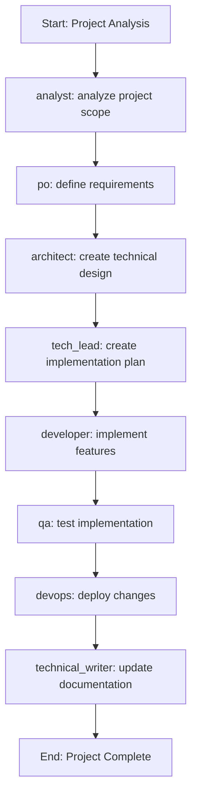

# Windsurf Cascade Integration

## Workflow Metadata

- **ID:** windsurf-cascade
- **Type:** brownfield
- **Project Types:** feature-addition, refactoring, modernization, ai-integration

## Description

Specialized workflow for developing and enhancing applications within the Windsurf Cascade environment. Includes specific steps for AI-assisted development and Cascade-specific tooling.

## Workflow Steps

### project_analysis

- **Agent:** analyst
- **Action:** analyze project scope
- **Notes:**
  Analyze the project to determine the scope of work:
  - Review existing codebase and documentation
  - Identify key components and dependencies
  - Determine integration points with Windsurf Cascade

### requirements_definition

- **Agent:** po
- **Action:** define requirements
- **Notes:**
  Define clear requirements for the Windsurf Cascade integration:
  - Document user stories and acceptance criteria
  - Identify any Cascade-specific requirements
  - Define success metrics
- **Requires:** project_analysis

### technical_design

- **Agent:** architect
- **Action:** create technical design
- **Notes:**
  Create technical design documentation:
  - System architecture
  - Component interactions
  - Data flow diagrams
  - Integration points with Windsurf Cascade
- **Requires:** requirements_definition

### implementation_plan

- **Agent:** tech_lead
- **Action:** create implementation plan
- **Notes:**
  Break down the work into manageable tasks:
  - Create implementation tasks
  - Estimate effort
  - Identify dependencies
  - Define acceptance criteria
- **Requires:** technical_design

### development

- **Agent:** developer
- **Action:** implement features
- **Notes:**
  Implement the required features:
  - Follow coding standards
  - Write unit tests
  - Document code
  - Use Cascade's AI assistance effectively
- **Requires:** implementation_plan

### testing

- **Agent:** qa
- **Action:** test implementation
- **Notes:**
  Test the implementation:
  - Unit tests
  - Integration tests
  - User acceptance testing
  - Performance testing
- **Requires:** development

### deployment

- **Agent:** devops
- **Action:** deploy changes
- **Notes:**
  Deploy the changes:
  - Prepare deployment package
  - Deploy to staging/production
  - Verify deployment
  - Monitor for issues
- **Requires:** testing

### documentation

- **Agent:** technical_writer
- **Action:** update documentation
- **Notes:**
  Update project documentation:
  - API documentation
  - User guides
  - Release notes
  - Architecture documentation
- **Requires:** deployment

## Roles

### Unnamed Role

**Description:** No description

### Unnamed Role

**Description:** No description

### Unnamed Role

**Description:** No description

### Unnamed Role

**Description:** No description

### Unnamed Role

**Description:** No description

### Unnamed Role

**Description:** No description

### Unnamed Role

**Description:** No description

### Unnamed Role

**Description:** No description

## Configuration

```yaml
artifact_storage: s3://bmad-artifacts/windsurf-cascade
default_retry_attempts: 3
max_concurrent_tasks: 3
notification_channels:
- slack
- email

```

## Flow Diagram



```

## Hooks

### Pre_Task Hooks

- **validate_environment**
  - Script: `scripts/validate_environment.sh`


### Post_Task Hooks

- **update_dashboard**
  - Script: `scripts/update_dashboard.sh`

